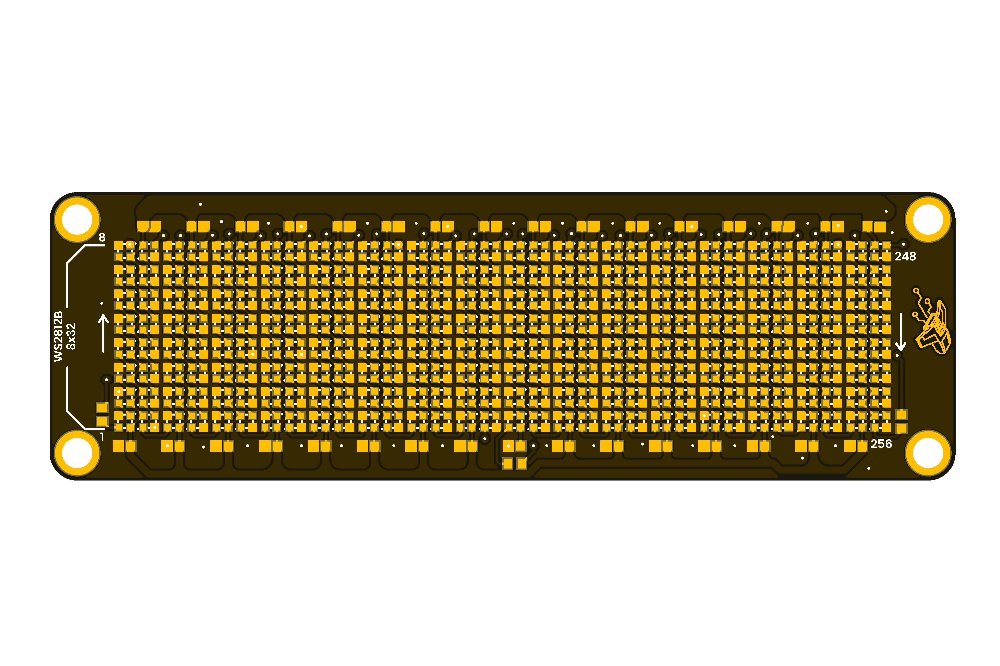

# Pulsar: Neopixel Shield

The shield matrix is designed to be compatible with the Pulsar development board format, featuring 256 RGB LEDs. This allows for independent control of each pixel to create a wide range of visual effects, from simple patterns (solid colors, bars, gradients) to complex animations (waves, scrolling text, sprites, indicators). This makes it ideal for applications in interactive displays, wearables, and creative projects.

  
  
<em>Development Board</em>

### Quick Setup

## Overview

| Feature           | Description                                         |
|-------------------|-----------------------------------------------------|
| **LED Count**     | 256 RGB LEDs (WS2812B)                              |

## Applications

## Resources

- [Schematic Diagram](./hardware/unit_sch_v_1_0_0_pulsar_neopixel.pdf)
- [Pinout Diagram](./hardware/unit_pinout_v_1_0_0_ue00118_pulsar_neopixel_shield_en.pdf)
- [Getting Started Guide](#)

## 📝 License

All hardware and documentation in this project are licensed under the **MIT License**.  
See [`LICENSE.md`](LICENSE.md) for details.

  Template created by UNIT Electronics

