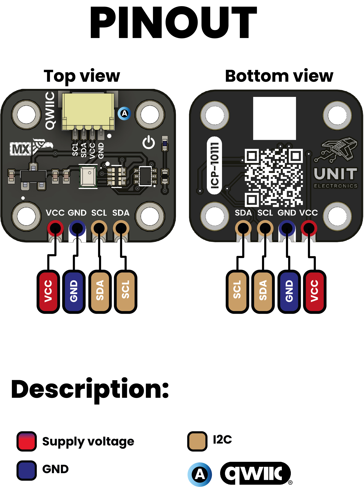
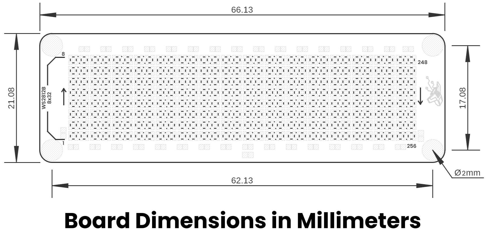
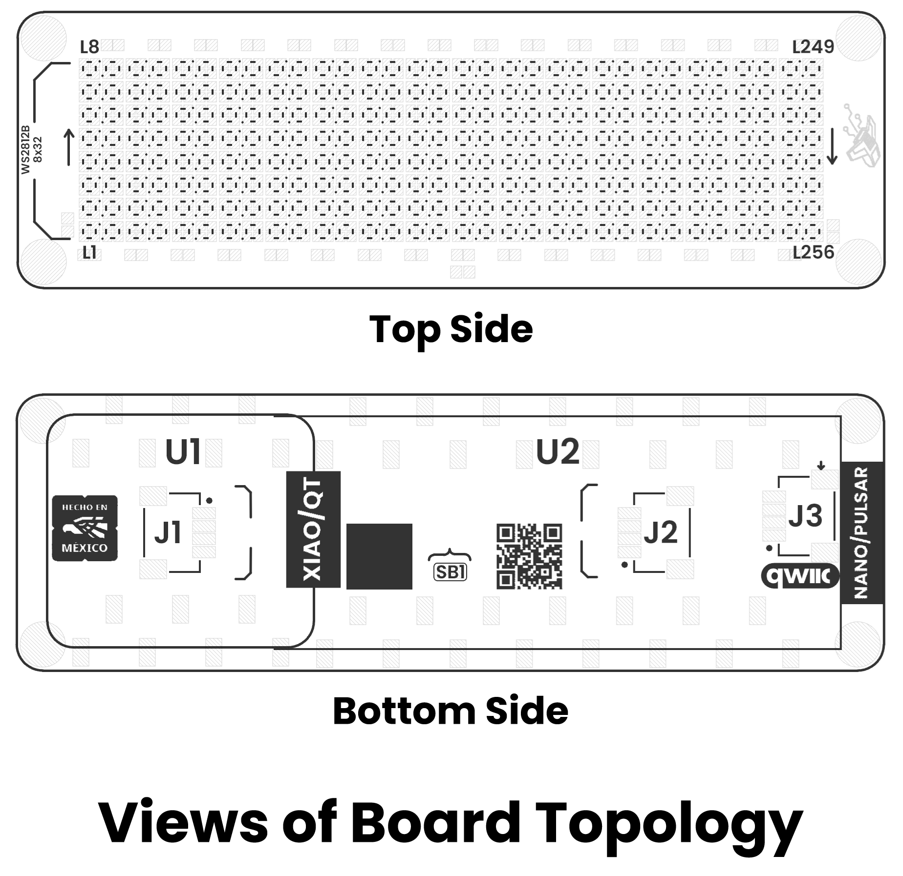

# Hardware

<a href="./unit_sch_v_1_0_0_pulsar_neopixel.pdf"> Schematic</a>

## Pinout

    <a href="#"> Pinout</a>
     
     
     
    
| Pin Label | Function | Notes |
|-----------|----------|-------|
| +3V3 | Power Supply | 3.3 V power rail for the shield and external interfaces. |
| GND | Ground | Common ground reference shared by controller boards, LED matrix and expansion connectors. |
| SDA | I²C SDA (A4/D18) | Serial Data Line available through the QWIIC connector. |
| SCL | I²C SCL (A5/D19) | Serial Clock Line available through the QWIIC connector. |
| DI1 | Matrix Data Input 1 | Data input for LED Matrix 1 (LED #1 to LED #128). Available on connector J2. |
| DI2 | Matrix Data Input 2 | Data input for LED Matrix 2 (LED #129 to LED #256). Available on connector J2. |
| DO1 | Matrix Data Output 1 | Data output from Matrix 1 for cascading additional WS2812B devices. Available on connector J1. |
| DO2 | Matrix Data Output 2 | Data output from Matrix 2 for cascading additional WS2812B devices. Available on connector J1. |
| SB1 | Solder Bridge | Optional solder jumper used to electrically connect Matrix 1 and Matrix 2 for single-signal operation (DI1). |

> **SB1 Configuration:**  
> When SB1 is left open, Matrix 1 and Matrix 2 can be controlled independently through DI1 and DI2.  
> When SB1 is shorted, both matrices are electrically linked, allowing all 256 LEDs to operate as a single 8×32 addressable RGB matrix controlled from DI1.

## Dimensions

<a href="./resources/unit_dimensions_v_0_0_1ue0118_pulsar_neopixel_shield.png">  Dimensions</a>

## Topology

<a href="./resources/unit_topology_v_0_0_1ue0118_pulsar_neopixel_shield.png">  Topology</a>
 
 
 

| Ref. | Description |
|-------|-------------|
| L1–L256 | Addressable RGB LEDs, WS2812B-compatible, 1.0 × 1.0 mm package, SMD 1010. |
| U1 | Header connectors for inserting a Pulsar or Nano-format controller board. |
| U2 | Header connectors for inserting a XIAO/QT-format controller board. |
| J1 | WS2812B data output connector, JST 1.0 mm pitch, for external WS2812B expansion from Matrix 1 and Matrix 2. |
| J2 | WS2812B data input connector, JST 1.0 mm pitch, for Matrix 1 and Matrix 2. |
| J3 | QWIIC connector, JST 1.0 mm pitch, for I²C interface. |
| SB1 | Solder bridge/jumper pad used to join both LED matrices so they can be controlled with a single data signal. |

> **SB1 Configuration:**  
> When SB1 is left open, Matrix 1 and Matrix 2 can be controlled independently through DI1 and DI2.  
> When SB1 is shorted, the output of Matrix 1 is routed to the input of Matrix 2, allowing all 256 LEDs to operate as a single 8×32 WS2812B matrix controlled from DI1.

> **Note:** The module also includes a Qwiic/STEMMA QT connector carrying the same four signals (VCC, GND, SDA, SCL) for effortless daisy-chaining.
